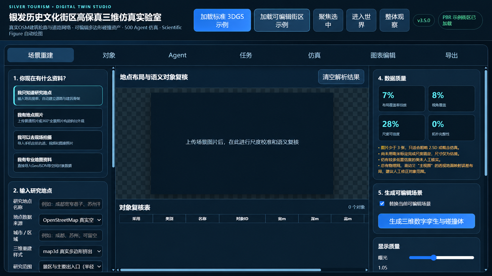

<div align="center">

# 银发历史街区语义数字孪生仿真实验室

### Silver Tourism Semantic Digital Twin Studio

从真实街区空间到 500 个银发 Agent：用于历史文化街区适老化研究、空间干预评估与论文图表生产的一体化实验平台。


<sub>概念封面：展示项目研究愿景。</sub>



<sub>v3.5.0 实际运行界面预览：场景重建、语义复核、数据质量与可编辑数字孪生入口。</sub>


[功能亮点](#功能亮点) · [快速开始](#快速开始) · [研究流程](#推荐研究流程) · [数据与隐私](#数据来源与隐私) · [English](#english-overview)

</div>

> [!IMPORTANT]
> 这是 **研究原型（research prototype）**，强调语义关系、Agent 行为与空间干预对比，不是测绘级成果，也不能替代现场踏勘、无障碍规范核查或工程设计。

## 它解决什么问题？

历史街区适老化研究往往横跨地图整理、三维建模、人群仿真、方案比较和论文制图，工具链长且难以复现。本项目把这些环节放进一个浏览器工作台：输入地点、照片、轨迹或 GeoJSON，建立可编辑语义场景；配置不同年龄层的银发 Agent；运行设施可达性、道路导视性与环境安全性任务；最后导出数据、图表和 GLB 场景。

## 功能亮点

| 模块 | 能力 | 研究价值 |
| --- | --- | --- |
| 真实街区重建 | OSM 建筑多边形与道路网络；高德/百度选点后转 WGS84；内置离线街区模板 | 从地点名称快速获得可复核的空间骨架 |
| 多源资料接入 | 普通照片、360°全景、GPX/CSV 轨迹、现场视频代表帧、GeoJSON、3DGS/GLB | 把公开地图与现场资料合并到同一语义模型 |
| 可编辑数字孪生 | 建筑、道路、人行道、台阶、设施、车辆、树木、导视、座椅、护栏、路灯均可编辑 | 支持对象级复核、碰撞体与方案干预 |
| 500 Agent 仿真 | 60–69、70–79、80+ 年龄层；步速、导航、视域、外观、帽子/背包/手杖 | 表达银发群体内部差异，而非“平均老人” |
| 三级任务系统 | 设施可达性、道路导视性、环境安全性；可编辑阈值与权重 | 将空间品质转为可量化、可复现实验任务 |
| 空间干预实验 | 人行道、导视、障碍、人车分流、休息区、过街、照明、车流、人群密度 | 快速比较基线与改造方案 |
| 科研成果输出 | 25 类可编辑 Scientific Figures、PNG/SVG、数据 ZIP、GLB | 直接衔接论文、汇报与开放数据流程 |
| 可选模型增强 | 兼容多模态 API、分组大模型策略与 World Labs 场景 | 在不改变个体特征的前提下扩展策略或重建能力 |

## 快速开始

### Windows（最省事）

1. 安装 [Node.js 20+](https://nodejs.org/)。
2. 下载或克隆本仓库。
3. 双击 `双击启动应用.vbs`。
4. 浏览器访问 `http://127.0.0.1:8092`，右上角确认显示 `v3.5.0`。
5. 使用完毕后双击 `关闭应用.bat`。

### macOS / Linux / 通用命令行

```bash
git clone https://github.com/Zhangweihui666/silver-tourism-digital-twin.git
cd silver-tourism-digital-twin
npm start
```

然后打开 <http://127.0.0.1:8092>。主应用已经预构建，基础场景和仿真流程无需 `npm install`。

如需服务器端科研制图回退能力：

```bash
python -m pip install -r requirements-optional.txt
```

## 推荐研究流程


最短演示路径：

1. 点击顶部 **“加载可编辑街区示例”**。
2. 在“对象”模块检查建筑、道路、导视、座椅、树木与车辆。
3. 在“Agent”模块查看 500 个银发 Agent 的分层参数。
4. 在“任务”模块检查三类研究指标和九个默认子任务。
5. 在“仿真”模块调整空间干预参数并运行实验。
6. 在“图表编辑 / 导出”中生成科研图表、数据包和 GLB。

## 地点重建模式

- **OpenStreetMap**：无需 Key，依赖公开服务可访问。
- **高德 / 百度选点 + OSM 几何**：国内地点检索、周边 POI、最多三条步行路线，并转换到 WGS84。
- **离线模板**：无网络时可使用宽窄巷子、平江路、夫子庙、三坊七巷、南锣鼓巷、丽江古城、大理古城、乌镇、周庄和田子坊等研究模板。
- **map3d / VoxCity 风格**：真实多边形挤出或语义分层体素表达。

## 数据来源与隐私

- OSM 数据须遵守 [OpenStreetMap 版权与署名要求](https://www.openstreetmap.org/copyright)。
- 高德、百度、World Labs 与自定义模型能力需要用户自行提供相应服务的 API Key，并遵守服务条款。
- 地图 Key 与模型 Key 只随当前请求传给本机服务；仓库不包含任何真实 Key。
- 上传的场景文件保存在本机 `uploads/`，该目录已被 Git 忽略。
- 正式论文应记录数据来源、采集日期、现场修正和误差范围。

## 技术结构

- Three.js / WebGL 三维场景与对象编辑
- Gaussian Splatting（PLY / SPLAT / KSPLAT / SPZ）兼容入口
- 原生 Node.js HTTP 服务与地图 / 模型代理
- Matplotlib + NumPy 科研图表回退
- 预构建前端，可在本机离线模板模式运行

## 仓库状态与已知限制

- 当前公开包来自 v3.5.0 最终交付运行包，包含 **预构建前端 `dist/`**，未包含原始模块化前端源码；欢迎在 Issues 中讨论后续源码整理与开放计划。
- “加载可编辑街区示例”是当前推荐演示入口。
- 部分设备点击“加载标准 3DGS 示例”可能出现材质颜色兼容性报错；可直接使用可编辑街区示例或手动导入 3DGS 文件。
- 在线地点与 OSM 查询受第三方公开服务可用性、速率限制和地区网络条件影响。

## 参与贡献

欢迎提交 Issue、研究案例、数据格式适配、验证结果和可复现实验方案。请先阅读 [CONTRIBUTING.md](CONTRIBUTING.md) 与 [SECURITY.md](SECURITY.md)。

如果这个项目对你的数字孪生、适老化、历史街区或 Agent 仿真研究有帮助，欢迎点一个 ⭐ Star，让更多研究者看到它。

## 引用

如果本项目进入你的论文、课程或研究报告，请使用仓库中的 [CITATION.cff](CITATION.cff)。

## English overview

**Silver Tourism Semantic Digital Twin Studio** is an integrated research prototype for building editable semantic scenes of historic districts and evaluating age-friendly spatial interventions with 500 heterogeneous pedestrian agents.

It combines real OSM geometry, optional domestic map selection, photo/trajectory/GeoJSON inputs, object-level 3D editing, task-based agent simulation, intervention controls, and publication-oriented figure export. The three core research dimensions are facility accessibility, wayfinding legibility, and environmental safety.

Quick demo: run `npm start`, open `http://127.0.0.1:8092`, load the editable district sample, inspect the Agent and Task modules, run an intervention scenario, and export figures or GLB.

---

<div align="center">
Made for reproducible age-friendly historic-district research. If it is useful, please consider starring the repository. ⭐
</div>
